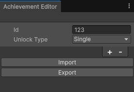

# Configure achievements with the Achievement Editor

Use the **Achievement Editor** to create and configure achievements in your game.

*Example of the Achievement Editor Window with a Single achievement type*

Use the following steps to add achievements to your project:

1. In the Unity Editor, navigate to **Window** > **Platform Toolkit** > **Achievement Editor**.
2. Add achievements by selecting the **Add** (**\+**) button.
3. Enter a unique ID for each achievement, and a corresponding ID for each platform you want to target.
4. Set the **Unlock Type** to one of the following options.
   1. **Single**:  For achievements that are unlocked once.
   2. **Progressive**: For achievements that track a progress value.
5. For **Progressive** achievements, set a **Progress Target** value. This is the progress value at which achievement is unlocked.

A warning icon might appear next to each platform or achievement ID if there are any issues with the configuration. Hover over the icon to display details about the issue. If a warning appears next to an ID for a  platform you're not currently targeting, open the **More** (**⋮**) menu and select **Toggle Ignore** to dismiss the warning.

> [!NOTE]
> For platforms that don't support progressive achievements, this behavior is handled by the Platform Toolkit API. Refer to the [scripting documentation](xref:Unity.PlatformToolkit.IAchievementSystem) for more information.

## Additional resources

* [Introduction to achievements](achievements-introduction.md)
* [Unlock achievements](unlock-achievements.md)