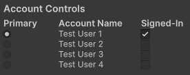

# Respond to sign-in events

When attempting to access an account on some platforms, such as the default account, user input is often requested. You can simulate this behavior with the **Play Mode Controls** window.

*Example of the Account Controls in the Play Mode Controls window*

Selecting an account as **Primary** will automatically sign the account in.

> [!NOTE]
> You might be able to sign in multiple accounts depending on the platform you're targeting. You can use **Behaviors** to simulate different platform capabilities. For more information, refer to [Control Editor Behaviors](control-editor-behaviors.md).

The signed in state for account is persistent when entering and exiting Play mode. Some platforms will select an account that's already signed in when calling for the primary account. If you want to minimize interaction with this window while testing your game in the Unity Editor, configure the signed-in and primary account ahead-of-time using the **Play Mode Controls** window.

## Additional resources

* [IPrimaryAccountSystem.Establish](xref:Unity.PlatformToolkit.IPrimaryAccountSystem.Establish)
* [Play Mode Controls window reference](play-mode-controls-settings-reference.md)