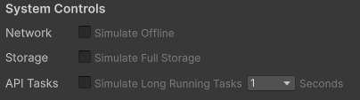

# Simulate common failures

The Play Mode Controls in the Unity Editor allow for testing for common failure cases when using the Platform Toolkit API.

*System Controls in the Play Mode Controls window*

Using the System Controls section of the **Play Mode Controls** window, it's possible to simulate the following scenarios:

* Losing network connection.
* No available storage space remaining .
* Simulate long running asynchronous tasks.

When enabling the **Network** and **Storage** options, API calls that might fail when these cases are true will throw appropriate exceptions, allowing you to test these edge cases in your games without having to deploy to a device.

As the behavior of all API methods in the Platform Toolkit package is simulated within the Unity Editor, and doesn't communicate directly with any platform systems and services, these methods can often complete too quickly to effectively test loading screens and UI transitions. By enabling **Simulate Long Running Tasks**, you can introduce an artificial delay into all asynchronous methods.

## Additional resources

* [Play Mode Controls window reference](play-mode-controls-settings-reference.md)